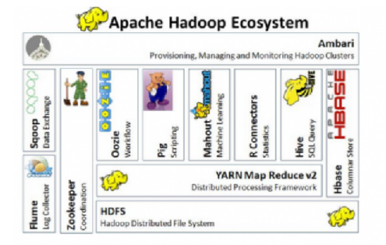
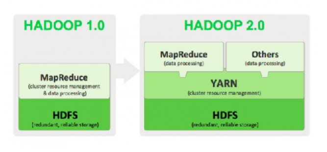
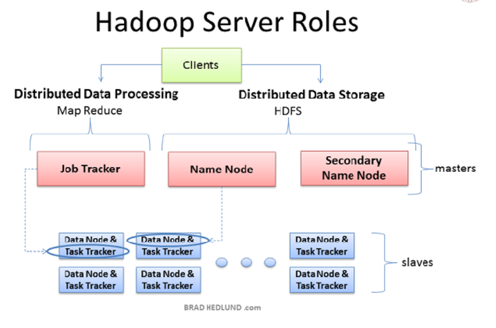
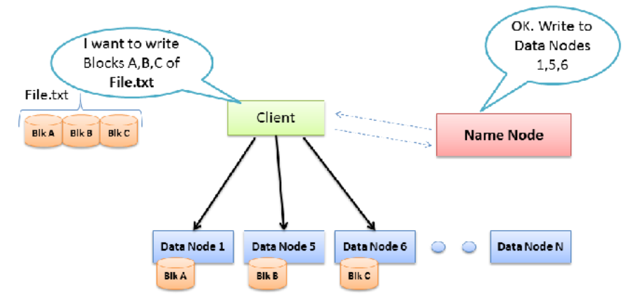
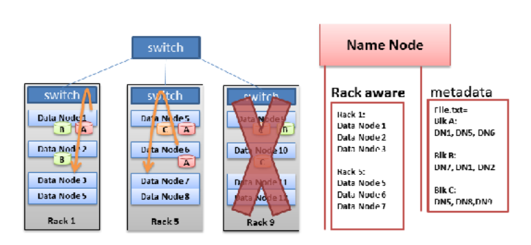

-- date: 20190608

# Hadoop 简介

## 概述

Hadoop 是关于处理和存储的。 Hadoop 是一个软件框架环境，它在使
用商业硬件搭建的分布式文件系统上提供了并行处理环境。 Hadoop 集群
由主进程和多个实用 x86 CPU 的服务器传播的从属进程组成。此框架允许构
建一个具有高性能超级计算机运算能力的 Hadoop 集群。

> 助记词: Hadoop
> （分）分布式存储，
> （广，廉）部署集群机器，
> （强）高计算能力

## Hadoop 1.0

HDFS 和 MapReduce 是 Apache hadoop 1.x 的核心有两个主要组件:

hadoop 分布式文件系统（ HDFS）和 MapReduce 并行处理框架。它们都是使用 Google 内部创建的技术开发的两种开源项目。

## Hadoop 2.0?

Hadoop 框架的发展是为满足其自身的普及和使用的要求， 2.0 体现了开源项目的成长和成熟的过程。

Apache Hadoop 项目由以下模块组成：

- Hadoop Common：为其他 Hadoop 模块提供支持的公共功能
- HDFS： Hadoop 分布式文件系统
- YARN：一个用于集群资源管理和任务调度的框架
- MapReduce：在可扩展的并行框架中处理大量数据集

## Hadoop 1.0 和 2.0 的区别

## Hadoop 2.0 有一个名为 YARN 的层:

YARN 的工作原理
YARN 的基本理念是将 JobTracker/TaskTracker 的两大主要功能分成不同的实体:

- ❀ 全局的资源管理器
- ❀ 每个应用的应用程序管理器
- ❀ 每个从属节点的节点管理器以及在节点管理器上运行的每个应用程序容器

## 传统系统 vs Hadoop

Hadoop 不是为了取代现有的关系型数据库或数据仓库而设计的。关系型数
据库旨在事务管理。它们包含许多围绕事务管理而设计的特色/功能。它们是基
于写入模式。商业组织花费了多年时间为其传统数据构建企业数据仓库 (EDW)
和报表系统。并且传统的企业数据仓库不会被第三方共享。数据仓库也基于写
入模式。

Hadoop 不是：

- ➢ Relational 关系型
- ➢ NoSQL 非关系型
- ➢ Real-time 实时的
- ➢ A database 数据库

Hadoop 是数据平台，一个值得称赞的数据系统。 Hadoop 是专为读取模式而设计的，可以处理大量的半结构化和非结构化数据。在 Hadoop 的存储成本较低的情况下，商业组织正在考虑使用 hadoop 来进行归档。

## 集群的概述

Hadoop 集群由以下组件组成:

- ➢NameNode：管理 HDFS 命名空间的主服务器。
- ➢DataNode：存储数据块的从属服务器。
- ➢ResourceManager（资源管理器）： YARN 处理框架的主服务器
- ➢NodeManagers（节点管理器）： YARN 处理框架的备服务器
- ➢HBase components（HBase 组件）： HBase 还拥有一个名为 RegionServers 的主服务器和备服务器。

在集群背景下工作的一些组件包括： ZooKeeper， Ambari，Ganglia， Nagios， JobHistory， HiveServer2， WebHCat 等.

## 什么是文件系统？

- OS 架构
- HDFA 架构
- 理解块存储（ Block Storage）
- 示范：理解块存储
- NameNode 名字节点
- DataNodes 数据节点
- DataNode Failure 数据节点容错
- HDFS Clients （HDFS 客户端）

hadoop 中的数据存储在称为 HDFS-Hadoop 分布式文件系统的文件系统中。在
HDFS 中，数据被分解成块，并分布在一组机器上。
在讨论 HDFS 之前，让我们来看看常见文件系统的功能:

- ➢ **Namespace** 命名空间：多级目录树和文件名。
- ➢ **Metadata** 元数据：目录树中的所有节点都可以拥有不同级别的所有权 (用户、
  组、匿名)、权限 (读取、写入、执行)、上次访问时间、创建时间、修改时间、
  隐藏等。
- ➢ **Journaling** 日志：可靠的文件系统将在出现故障时维护编辑日志，如电源或磁盘
  故障。日志将包含与编辑和某些实现相关的元数据，即要刷新到磁盘的实际数
  据。
- ➢ **Storage** 存储：文件系统中的存储位于物理或网络连接的存储设备上。这些设备
  将保留数据， 按照 chunked 划分 blocks。
- ➢ **Tools** 工具：所有文件系统都有执行文件操作的工具以及管理操作 (如故障排除
  和修复问题)

## 如何写入到 HDFS

1. 客户端咨询 NameNode
1. 客户端将块直接写入一个数据节点
1. 数据端复制块
1. 下一个块的循环重复

## HDFS 架构

Hadoop 实例由一组 HDFS 机器组成；通常称为 Hadoop 集群或 HDFS 集
群。 HDFS 集群有两个主要组件:

- NameNode： HDFS 的 "主" 节点，它通过确定和维护数据块在 DataNodes 中的分布方式来管理数据 (而不实际存储)。NameNode 将包含和管理命名空间、元数据、日志记录和 BlockMap。 BlockMap 是在 HDFS 集群中组成文件和 DataNode 位置的所有块的内存中映射。

- DataNode：存储数据块，并负责在其他 DataNodes 中复制块。

NameNode 和 DataNode 是在集群中运行的守护进程。涉及 NameNode 和 DataNode 的一些重要概念是:
By default only one NameNode is used in a cluster， which creates a single point offailure.We will later discuss how to enable HA in Hadoop to mitigate this risk.

- ➢ 默认情况下，集群中只使用一个 NameNode，以创建一个单失败点。稍后我们将讨论如何在 Hadoop 中启用 HA 以减轻此风险。
- ➢ 数据从不驻留或通过 NameNode。你的大数据只驻留在 DataNode。
- ➢ DataNode 被称为 "奴隶" 守护程序到 NameNode，并不断地与 NameNode 沟通他们的状态。
- ➢NameNode 跟踪数据如何分解为 DataNode 中的块。
- ➢ 默认块大小为 128MB (但可配置)。
- ➢ 默认复制因子为 3 (也是可配置的)，这意味着每个数据块都在 3DataNode 中复制。
- ➢DataNode 与其他 DataNode (通过 NameNode 的命令) 通信以实现数据复制。

## 理解块存储

将文件放入 HDFS 参考以下步骤:

- ➢ 客户端应用程序向 NameNode 发送一个请求，指定要在 HDFS 中放置文件的位置。
- ➢ NameNode 为客户端提供了文件路径的租约。如果在写入成功且文件句柄已关闭时，如果出现故障、超时或永久化，则此租约将被释放。
- ➢ 对于客户端需要编写的每个块 (默认情况下为 128MB)，客户端将向 NameNode 请求一个新的 blockid 和一个 DataNodes 的目标列表，以便将新块写入何处。
- ➢ 一旦客户端获得 blockid 和目标 DataNodes，它将开始将其缓冲区刷新到列表中的第一个 DataNode。
- ➢ 复制块，第一个 DataNode 将打开一个流到列表中的下一个 DataNode，并将其持续的块刷新到该 DataNode。此块复制管道建立到列表中的所有节点上。因此，复制是非常有效的，并且是并行处理的。

### NameNode

当 NameNode 启动时，它会读取 fsimage_N 和 edits_N 的文件。

1. edits_N 中的数据处理与 fsimage_N 合并。
2. NameNode 将进入安全模式，一种只读模式。
3. 新创建的 fsimage_N+1 会被写入磁盘，一个新的空 edits_N+1 会随之创建。
   fsimage
   edits
   现在，客户端程序可以在 HDFS 中创建一个新文件。
4. 在 edits_N+1 文件中创建事务的 NameNode 日志。

NameNode HDFS 有一个主/从体系结构。 HDFS 集群由一个 NameNode 组成，它是一个
管理文件系统命名空间并且还调节客户端对文件的访问的主服务器。
NameNode 具有以下特点:

- ➢ 管理 DataNodes
- ➢ 执行文件系统命名空间操作，如打开、关闭和重命名文件和目录。
- ➢ 确定块映射到 DataNodes。
- ➢ 维护文件系统命名空间。

### NameNode 通过维护两个文件来执行这些任务

- ➢ fsimage_N：包含整个文件系统命名空间，包括将块映射到文件和文件系统属
  性。
- ➢ edits_N：一个事务日志，它持续记录对文件系统元数据发生的每个更改。
- ➢ 当 NameNode 启动时，它进入安全模式 (只读模式)。它从磁盘加载 fsimage_N
  和 edits_N，将 edits_N 中的所有事务应用于 fsimage_N 的内存表示形式，并将
  此新版本刷新到磁盘上的新 fsimage_N 中。
- ➢ 例如，最初你有一个 fsimage_0 文件和一个 edits_inprogress_0 文件。当合并发
  生时， edits_inprogress_0 中的事务将与 fsimage_0 合并，并创建一个新的
  fsimage_1 文件。此外，还为创建 fsimage_1 后发生的所有未来事务创建一个新的
  空 edits_inprogress 文件。
- ➢ 此过程称为检查点。一旦 NameNode 成功写入检查点，它将离开安全模式，从而
  启用写入。

### DataNode

HDFS 公开一个文件系统命名空间，并允许用户数据存储在文件中。在内
部，文件被拆分为一个或多个块（block），这些块存储在一组 DataNodes
中。

NameNode 决定块到 DataNodes 的映射。 DataNodes 负责:

- ➢ 处理应用程序客户端的读写请求。
- ➢ 在 NameNode 的指令下执行块创建、删除和复制。 (NameNode 对块的复
  制做所有决定）。
- ➢ 发送心跳到 NameNode
- ➢ 将存储在 DataNode 中的块发送到块报告（ Blockreport）中。

NameNode 周期性地从群集中的每个 DataNode 接收心跳（ Heartbeat）和
块报告（ Blockreport）。接收心跳意味着 DataNode 正常工作。块报告包含
DataNode 上所有块的列表。

DataNode 具有以下特点：

- ➢ DataNode 不关心 HDFS 文件的概念
- ➢ 它存储每一块 HDFS 数据在它们本地的文件系统中的单独文件下
- ➢ DataNode 在同一本地字典中不会生成所有文件

当 DataNode 启动时，它会扫描其本地文件系统，生成与这些本地文件
对应的所有 HDFS 数据块的列表，并将此信息发送到 NameNode (作为 块
报告)。

DataNode Failure DataNode 容错

HDFS 的主要目标是可靠地存储数据，即使在出现故障时也是如此。
Hadoop 的设计目的是从 DataNode 的磁盘故障或网络故障中优雅地恢复，
方法是使用以下准则：

- ➢ 如果 DataNode 无法向 NameNode 发送心跳，则 DataNode 被标记为死
  亡状态。
- ➢ 数据中已被注册为死亡状态的 DataNode 均不再用于 HDFS。
- ➢ NameNode 不再向死亡状态的 DataNode 发送新的 I/O 请求，其 Block 被复
  制到活着的 DataNode 中。
- ➢ DataNode 的死亡通常会导致某些块的复制因子低于其指标。 NameNode
  持续不断跟踪需要复制那些块，并在必要时启动复制。

Hadoop 机架服务器感知---原因？

● 如果整个机架服务器出现故障，不会丢失所有数据
● 在可能的情况下保持机架内的大数据流量
● 存在一个假设： 机架内部是高带宽，低延迟
