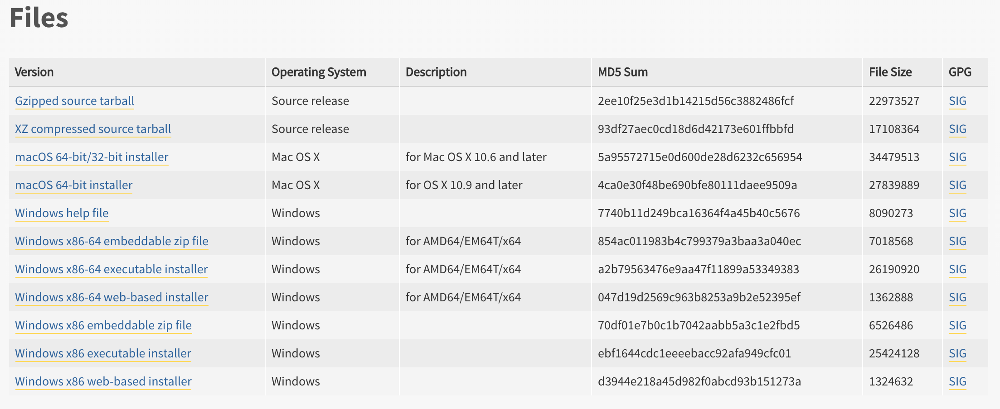
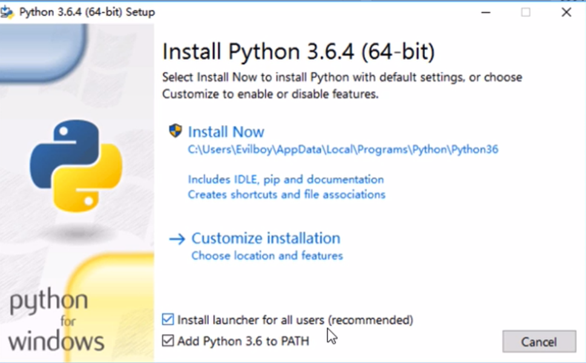

# 人生苦短，我用 Python

## 初识 Python 

* Python秉承着 “简单”，“明确”，“优雅” 的设计哲学
* Python 的生态圈十分完善
* Python 善于开发web，GUI，操作系统，科学计算，人工智能，游戏

## Python 的特点

* 属于动态语言
* 可扩充的语言
* 面向对象并面向过程的语言
* 简洁，开发高效，维护成本低的语言
* 可跨平台，功能强大

## 版本的选择

* 目前的版本是 2.x 和 3.x
* 官方计划在2020年放弃支持 2.x
* 2.x 最后一个版本是 v2.7
* 目前最新版本是 3.7.x
* 官网 www.python.org 

## Python 开发环境

* 下载 Python3.7.x 下载页面 https://www.python.org/downloads/release/python-373/ 
  
* windows 环境安装 在下载页面 推荐下载 **executable installer** 版本
  
  > 注意要勾选add Python 3.x to Path
* MacOS 环境安装  
  > MacOS 版本安装后，在Terminal 中 使用 python3 启动 v3.7.x的运行环境
* Linux( centos 版本) 系统安装
  - 通过 ssh 命令登录到目标计算机上
  - 由于centos 预装了python 2.7.5 因此需要另行安装v3.7.x
    - 方法一：源码安装，然后Gcc编译器进行编译
    - 方法二：yum install，推荐
    ```shell
    # yum install epel-release // 安装yum source
    # yum install python37 
    ```
* IDE 选择 
  * virtual studio 20XX 
  * PyCharm
  * vs code

## 运行Python
* windows 在 cmd 里面执行 命令 **python**
* MacOS 在Terminal 执行命令 **python3** 
* Linux 在Terminal 执行命令 **python37** (如果安装的是python3.7)
  